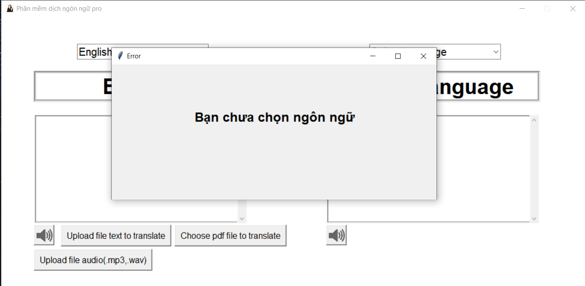

## profile information

### install packages 
```
pip install -r requirements.txt

```

### Execute Program
```
python translate1.py
```

<<<<<<< HEAD
### tuan tu cong viec 

=======
### Sample run 

>>>>>>> e05dbf59d2eb3d7261740c8644762b12b65a2b4f

